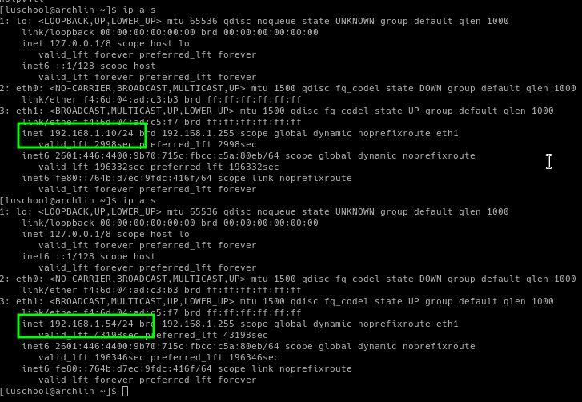
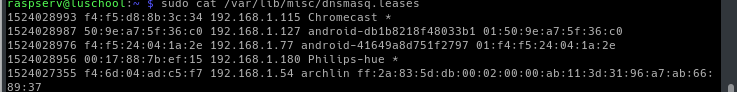
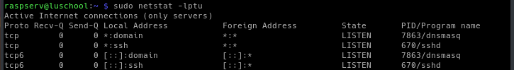

# Team Oops Slackers Week 3 Individual Documentation
### By Luschool

This is my documentation for my personal research and progress for week 3 of the group project.

**Important Links -**
* [Private GitHub Team](https://github.com/orgs/FOSSClass/teams/oops-slackers)
* [Week 1 Update](https://github.com/luschool/oopsslackerstemp/blob/master/OopsSlackersWeek1Individual.md)
* [iPXE Chainloading With dnsmasq](https://qiita.com/arachan@github/items/666ca37e0d3d93c379a9)


## Table of contents
1. [Summary](#sum)
2. [dnsmasq DHCP Trial](#trial)
3. [dnsmasq PXE intergration and DNS info](#pxe)
4. [Goals Going Forward](#future)

<a name="sum"></a>

## Summary -  

This week started out as a pretty big headache for me. It's overwhelming when you can't fully
wrap your head around how all these pieces fit together. I started the week analyzing 
the firewall/router and other accessories that Mr. Harmon let me borrow. Once I started 
reading into the opnsense software installed on the firewall/rotuer it made me even 
more unsure. It's possible I would have a better time understanding if I backed up 
the config settings and started from scratch so that way I leanred the process
each step of the way; however until I talk to him again at class on Wednesday to get 
his permission I decided to hold off. 

This took me back to what I was exploring last week - 'dnsmasq'

My intention is to fully configure and deploy dnsmasq on my raspberry pi. That way I have a local 
server I can trial and error with endlessly with while learning iPXE implementation. 


<a name="trial"></a>

## dnsmasq DHCP Trial - 

**Links -**
* [dnsmasq Package](https://packages.debian.org/stretch/dnsmasq)
* [dnsmasq DHCP Documentation and Guide](https://www.raspberrypi.org/learning/networking-lessons/lesson-3/plan/)
* [Documentation FAQ](http://www.thekelleys.org.uk/dnsmasq/docs/FAQ)

Installed package with command -
`sudo apt-get install dnsmasq`

Edited /etc/network/interfaces and commented the DHCP configuration out and added static IP settings after-
```
#iface eth0 inet dhcp
auto eth0
iface eth0 inet static
address 192.168.1.30
netmask 255.255.255.0
```

The reason I configured the address as .30 and not .1 is for a few reasons. First my router is 192.168.1.1
and second I dont want to have any clashes with other devices using the routers DHCP while im configuring this.
I also plan to make the DHCP addressable range start at 31 so when I do disable my routers DHCP server
and flush devices they will all get assigned higher number addresses so I dont have to second guess if it works.

Next the networking service needed to be restarted to reflect the static IP change.
`sudo service networking restart`

Time to backup our dnsmasq config so we have an untouched copy. 
`sudo mv /etc/dnsmasq.conf /etc/dnsmasq.default`

Once backed up a new file will be made with `sudo nano /etc/dnsmasq.conf`
The following configuration was placed into it -
```
#set DHCP interface and DHCP address ranges with lease length
interface=eth0
dhcp-range=192.168.1.31,192.168.1.254,255.255.255.0,12h

```
First line tells the service dnsmasq what ethernet device to listen for requests on.
Second line sets the assignable address range from .30 - .254 with a 12 hour lease time. 

Time to give it a test! `sudo service dnsmasq restart`

Now that the service is up and running I will disable my routers DHCP server.
Once disabled I reset my local ethernet port and restarted my network.service.

Surprisinly it worked and I have a new ip! I can also connect to google.com which
I didn't expect.



Running `cat /var/lib/misc/dnsmasq.leases` on my server I can see the details of each
lease the service has handed out. 



My excitement is shortlived though. I wasn't able to reach any other server that I tried
other than google. From a few searches it probably has to do with either default gateway,
DNS, or ipv6. Seeing as I completly spaced on setting a default gateway I'll try that now.


Adding these lines to `/etc/dnsmasq.conf` which is where we defined the DHCP ranges earlier.
```
#set default gateway
dhcp-option=3,192.168.1.1
```

That seemed to fix my issues but I havn't been able to test from many other devices so it's
hard to say 100%.

This is a good time to run a netstat to see if its listening correctly. `sudo netstat -lptu`




I will continue testing it under different circumstances throughout the next two days 
before class to ensure its working as intended.

<a name="pxe"></a>

## dnsmasq PXE intergration and DNS info - 

**Links -**
* [dnsmasq Package](https://packages.debian.org/stretch/dnsmasq)
* [dnsmasq DNS Documentation and Guide](https://www.raspberrypi.org/learning/networking-lessons/lesson-4/plan/)
* [dnsmasq DNS Short Overview](https://www.linux.com/learn/dnsmasq-easy-lan-name-services)
* [dnsmasq PXE Boot Examples](https://www.richud.com/wiki/Network_iPXE_dnsmasq_Examples_PXE_BOOT)
* [dnsmasq PXE Apache config](http://backreference.org/2013/11/24/pxe-server-with-dnsmasq-apache-and-ipxe/)
* [iPXE Chainloading With dnsmasq](https://qiita.com/arachan@github/items/666ca37e0d3d93c379a9)

During my trials and research I found a lot of interesting information about the DNS side of dnsmasq.
I don't think for our specific uses it would be required, but I thought it was interesting and 
informative none the less.

Now comes the time where things need to start working together and operating as expected. The service
dnsmasq offering a simple way to setup dhcp tftp and pxe intergration is what got me interested in it last week.
Please check out the important links for this section as they will lay down a lot of information for bringing
everything together.

Below are some of the configuration options I found in the default dnsmasq.conf file.
```
#Send vendor-class specific options encapsulated in DHCP option 43.
#The meaning of the options is defined by the vendor-class so
#options are sent only when the client supplied vendor class
#matches the class given here. (A substring match is OK, so "MSFT"
#matches "MSFT" and "MSFT 5.0"). This example sets the
#mtftp address to 0.0.0.0 for PXEClients.
#dhcp-option=vendor:PXEClient,1,0.0.0.0

#Set the boot filename for netboot/PXE. You will only need
#this is you want to boot machines over the network and you will need
#a TFTP server; either dnsmasq's built in TFTP server or an
#external one. (See below for how to enable the TFTP server.)
#dhcp-boot=pxelinux.0
```


<a name="future"></a>

### Goals Going Forward -  

I feel like I made a lot of progress this week even though it started out rocky. I have a working DHCP/TFTP server
that can also be easily configured for DNS if need be. We have a long ways to go but things are starting
to fall into place it seems. 

This article is extremly informative - * [iPXE Chainloading With dnsmasq](https://qiita.com/arachan@github/items/666ca37e0d3d93c379a9)

I plan to start configuring iPXE to attempt to get it to boot and function with my local server so I 
have an easy way to test functionality. 
