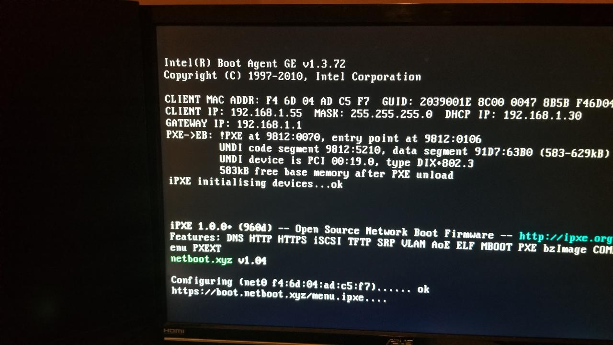
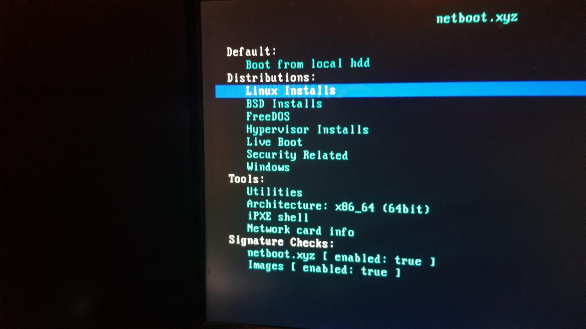
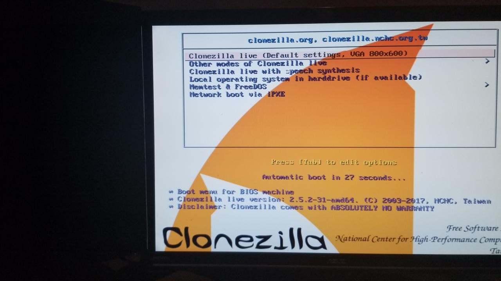
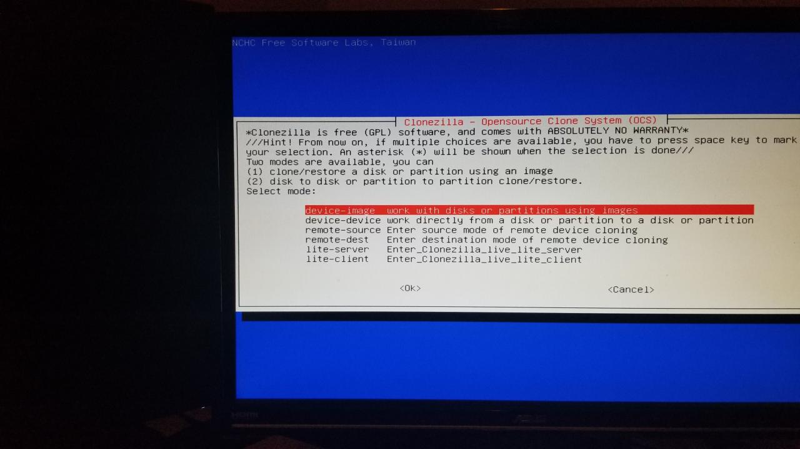

# Team Oops Slackers Week 4 Individual Documentation
### By Luschool

This is my documentation for my personal research and progress for week 4 of the group project.

**Important Links -**
* [Private GitHub Team](https://github.com/orgs/FOSSClass/teams/oops-slackers)
* [Week 1 Update](https://github.com/luschool/oopsslackerstemp/blob/master/OopsSlackersWeek1Individual.md)
* [Week 2 Update](https://github.com/luschool/oopsslackerstemp/blob/master/OopsSlackersWeek2Individual.md)
* [Week 3 Update](https://github.com/luschool/oopsslackerstemp/blob/master/OopsSlackersWeek3Individual.md)


## Table of contents
1. [Summary](#sum)
2. [dnsmasq and netboot.xyz](#dnsmasq)
3. [Trial run of netboot.xyz](#trial)
4. [Goals Going Forward](#future)

<a name="sum"></a>

## Summary -  

I finally feel like the end is in sight after some breakthroughs on multiple fronts this week.
I will briefly cover my setup and what I accomplished and the thoughts I have before going into 
detailed documentation in the next sections. I altered some more dnsmasq configuration to get 
dhcp booting from tftp with netboot.xyz working.

In my home environment I have my routers DHCP server disabled and am running dnsmasq to assign
leases to all devices on my LAN. My raspberry pi is connected to the switch portion of my router as
is my main computer. I was able to succesfully boot into the netboot.xyz iPXE menu from the network 
itself. This gets us close to where we need to be but not all the way there yet. 

I see a few issues going to arise when I use this setup in the school enviornment and have a few
ideas in mind to fix them.

First issue is I can't just plug my raspberry pi into the school network and expect to have dhcp control 
so I wont be able to point the computer to the netbootxyz file. This one could be fixed in a couple ways
I believe. The easiest way is just using the hardware Mr. Harmon provided me. I can just wipe the opnsense
settings and have it running as a basic router. This allows my raspberry pi to connect to 1 LAN port as the 
DHCP server and TFTP server. The school computer were working on would connect to the 2nd LAN port so we
don't have to use the schools network. Then the WAN port would connect to the Sprint LTE hotspot device 
to give us internet access.

That brings us to the discussion of the internet speeds of the LTE hotspot device. Obviously they will not be
spectacular speeds but I dont think we will need much speed if all goes as planned. My current plan is to 
use the setup above to boot into the netboot menu and initiate clonezilla which will download and initialize 
a live clonezilla enviornment. From there we can clone one of the working computers drives. The question is how
much space will be required and where will we store that clone? USB stick connected to the raspberry pi most likely.
Once we have that clone we can deploy that clone to each broken computer. 

<a name="dnsmasq"></a>

## dnsmasq and netboot.xyz - 

**Links -**
* [dnsmasq Package](https://packages.debian.org/stretch/dnsmasq)
* [netboot.xyz](https://netboot.xyz/)
* [dnsmasq Documentation FAQ](http://www.thekelleys.org.uk/dnsmasq/docs/FAQ)

First thing I did was do a trial run of my setup from last week to ensure everything was still functioning as 
it should. I'm thankful I did this first because I ran into an issue even though nothing changed from last week
yet. It seems when I setup my static IP on my pi I didn't do it properly. Turns out I have to edit `/etc/dhcpcd.conf`
and not `/etc/network/interfaces ` like I did last week.

I reverted my `/etc/network/interfaces` to its original configuration. Once that was done I edited `/etc/dhcpcd.conf`
in nano and added the following lines into the bottom of the file -
```
interface eth0

static ip_address=192.168.1.30/24
static routers=192.168.1.1
static domain_name_servers=192.168.1.1
```
After that was saved I rebooted my pi and restarted dnsmasq to do another trial run. Everything is functioning properly
so its time to move on. 

Last week I was still using tftpd-hpa as my tftp server and I want to remove that and just use dnsmasq for both DHCP and TFTP.

I purged the package and all config files with - 
`sudo apt-get purge tftpd-hpa`

Now I will make a new tftp directory - 
`sudo mkdir /var/lib/tftp`

With that made I will enable tftp by adding the following lines to `/etc/dnsmasq.conf` -
```
enable-tftp
tftp-root=/var/lib/tftp
```

Time to download the basic netboot.xyz.kpxe bootloader from netboot.xyz to see if I can get it functioning with my setup.
Once I downloaded the file I placed it in my newly created /var/lib/tftp/ directory.

Now we must edit the `/etc/dnsmasq.conf` to point the DHCP boot request to the netboot iPXE file on our tftp server. 
Thats accomplished by adding the following line - 
`dhcp-boot=netboot.xyz.kpxe`

To ensure all those edits are complete we must restart the dnsmasq service - 
`sudo service dnsmasq restart`


That completes this section and in the next I will cover my attempts to boot into the netboot.xyz iPXE enviornment on my 
main PC from a network connection. 

<a name="trial"></a>

## Trial run of netboot.xyz -

Before I can try to netboot I have to alter some BIOS settings. First I have to enable the PXE option on my
ethernet interface. Once that's complete I can alter the boot order or just save and restart. 

Now that I've restarted one of the first splash screens I see momentarily has a line of text saying Intel Boot Agent GE 
at the top. It quickly disappears and moves on to the screen I normally see showing my attached devices. For my ASUS
motherboard my boot menu hotkey at this time is F8. I press that and it brings up my boot options. 

I select my Intel Interface and it brings up the Intel Boot Agent again with a dhcp request. Before I have a chance 
to take a picture the request is completed and the following image was taken - 

 

As you can see it has my current computers IP assigned(CLIENT IP) my DHCP IP(raspberry pi IP) and my GATEWAY IP(Router).
It also confirms the iPXE initialization and netboot.xyz v1.04. At this time its configuring my net settings and getting
the default netboot.xyz menu from the https link at the bottom of the image. 

After that step finished it took me to the menu and this following pic was taken - 



This default menu has quite a few options and I decided to check out utilities and noticed Clonezilla sitting there. 
Our current roadblock at the moment is obtaining a windows image that is configured like the rest of the computers
in the classroom. Last week we all discussed and researched some ways to copy one of the existing computers over to 
the inoperative computers and this seems like the best bet. Assuming we get it to work this will allow us to accomplish 
every step from the iPXE environnment which was our original goal. 

I went ahead and selected the clonezilla utility to see its functionality. Once selected it downloads the small iso from 
the internet and brings me to this menu -




I selected the first option so I could boot into a live version of clonezilla. After a few initialization options like 
language it brought me to this menu - 




This is about as far as I can get until I bring my setup into the school enviornment to see about cloning. 


<a name="future"></a>

### Goals Going Forward -  

The current plan is wipe and configure the router Mr. Harmon provided for me so I can connect the school computer 
to a network outside of the schools and get into the netboot.xyz menu. All I should need to configure is port options
to give me 2 LAN ports and one WAN port. I intend to continue to use the DHCP server on my raspberry pi. I figured since I 
bought the raspberry pi and took the time to learn and configure it I might as well use it. 

I plan to come to class early to try to test my theory and get it working. Once I get it working I want to start the cloning
process to see how much disk space we may need and if we can trim it down. 

If were able to clone it then the next step is trying to deploy that clone to each down computer. 


