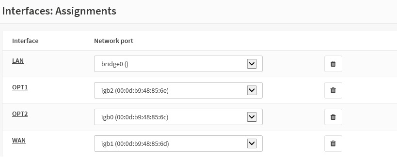
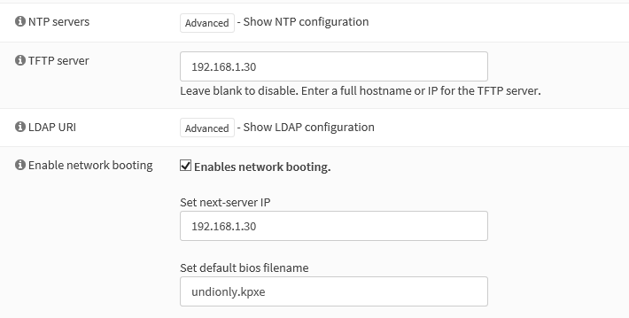
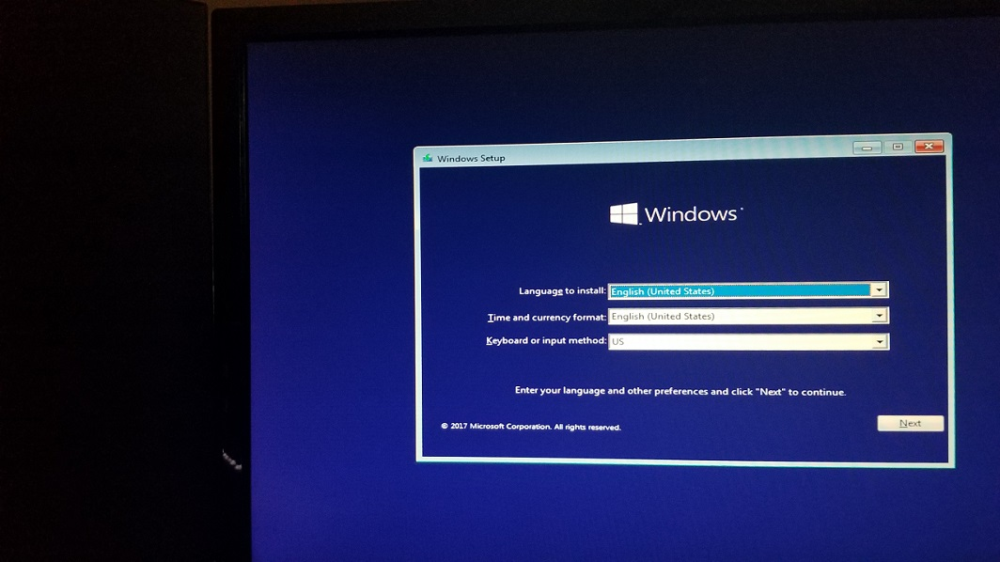
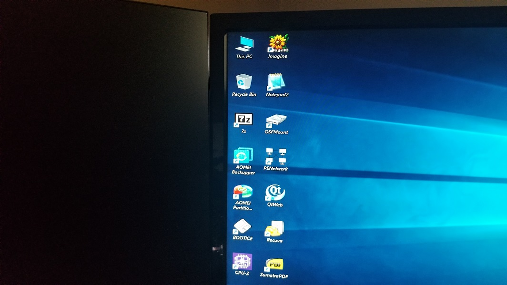

# Team Oops Slackers Week 5 Individual Documentation
### By Luschool

This is my documentation for my personal research and progress for week 4 of the group project.

**Important Links -**
* [Private GitHub Team](https://github.com/orgs/FOSSClass/teams/oops-slackers)
* [Week 1 Update](https://github.com/luschool/oopsslackerstemp/blob/master/OopsSlackersWeek1Individual.md)
* [Week 2 Update](https://github.com/luschool/oopsslackerstemp/blob/master/OopsSlackersWeek2Individual.md)
* [Week 3 Update](https://github.com/luschool/oopsslackerstemp/blob/master/OopsSlackersWeek3Individual.md)
* [Week 4 Update](https://github.com/luschool/oopsslackerstemp/blob/master/OopsSlackersWeek4Individual.md)


## Table of contents
1. [Summary](#sum)
2. [Opnsense configuration and iPXE bootloader](#opnsense)
3. [Trial run.xyz](#trial)

<a name="sum"></a>

## Summary -  

Last week I was having some troubles with all my devices communicating with eachother
on the router/firewall Mr. Harmon provided for our group to use on our service. 
I decided to start from scratch this week and reset the opnsense configuration back to
defaults. I documented my progress of configuring the opnsense settings as well as
compiling a new ipxe configuration. I also did another trial run to verify everything 
is in working order.


<a name="opnsense"></a>

## Opensense configuration and iPXE bootloader - 


Once the defaults were loaded I followed the wizard to assign my LAN IP as
192.168.1.1 and set my DNS servers to use Googles public DNS servers 8.8.8.8 8.8.4.4
I then went on to uncheck the DNS override by DHCP.

After doing some reading online I find a relativley simple way of bridging 2 of the 
network ports to operate as if theyre on the same network. The drawback seems to be 
that the bridging is done on a software level which could be limiting but for what
were doing it shouldn't come into play much. 

For the bridge itself I ended up assigning both the physical ports to OPT1 and OPT2 
and assigned the default LAN interface to a virtual bridge that I created. This way 
all the default firewall rules get carried over to both of the new OPT interfaces
I created. 



Due to my Raspberry pi having a static IP assignment of 192.168.1.30 I wanted to make 
sure the DHCP server built into the rotuer didnt hand out any assignments that would
interfer with it. That was easily accomplished by changing the IP assignment range
on the router to 192.168.1.40 to 192.168.1.245. 

To get pavels iPXE scripts to run on our local network we had to make some minor alterations.

I started by downloading the source files from github -` git clone git://git.ipxe.org/ipxe.git`

Some files may need to be accessed from HTTPS so we need to enable that in the source files.
To do that we must edit - `config/general.h` and change -
`#undef	DOWNLOAD_PROTO_HTTPS` to `#define	DOWNLOAD_PROTO_HTTPS`

To stop an infinite loop from hapening on some computers we need to insert a script to direct it
to our menu. We accomplish that by navigating to ipxe/src/ and running mkfile `chainb.ipxe`

edit with `nano chainb.ipxe` to add the following lines - 
```
#!ipxe
  
dhcp
chain --autofree tftp://192.168.1.30/pboot2.ipxe
```
This is an ipxe script that will direct our bootloader to pavels custom menu located on our
raspberry pi TFTP server. 

Now the source files need to be compiled and we must include that script by running the
following command - `make bin/undionly.kpxe EMBED=chainb.ipxe`
After the compilation completes it spit out the needed `undionly.kpxe` file in the bin/ directory. 
Now it needs to be transfered to the tftp server and pointed to via the opnsense DHCP 
server. I accomplish that by using ssh to access my pi with `ssh raspserv@192.168.1.30` Then 
opening another terminal and runnning `scp undionly.kpxe raspserv@192.168.1.30:~/`

I also took the Microsoft files pavel uploaded to sootsplash and ran a tar command on them so I could easily download
them straight from the weblink since theyre already hosted in our publicily accesible web folder. I placed those files on our TFTP server so our script could access them locally.
We can still access the files on sootsplash but with the speed restrictions of the sprint hotspot Mr. Harmon 
provided us. In most situations HTTP/HTTPS would be the prefered method of accessing those files but seeing as
they're remote we wanted to have another option available. 

Now that the iPXE files are located on our TFTP server we need to direct the DHCP server to our TFTP and bootloader.
During the iPXE boot process it sends out a special tagged DHCP request that lets the DHCP server know it's 
searching for a bootloader if its there. The DHCP server gets that request and hands out an ip and points the machine
to our TFTP server and undionly.kpxe file. 




<a name="trial"></a>

## Trial run -  

I ran a few trial runs on different systems to verify functionality.

I started by working on my home computer and attempting to boot into Pavel's menu that is stored on the pi. 

I was succesfully able to boot into the menu and load both the Windows 10 Installation files and the Live 
version of Windows 10 as shown below.





From the menu you can also jump to the netboot.xyz menu or straight into the iPXE shell. From the iPXE shell
you can run different iPXE specific commands. To test other menus and functions the chain command can be used
to jump straight into different .ipxe files. To accomplish this you run the command dhcp to confirm its configured
then run a command like `chain tftp://192.168.1.30/netboot.xyz.ipxe` to access the default netboot menu thats 
hosted on the TFTP server. You can also reach out to remote links outside the network for example -
`chain https://boot.netboot.xyz/menu.ipxe` or even `chain https://sootsplash.csci2461.com/pboot.ipxe`

